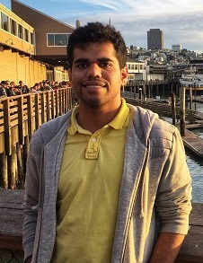

  

      <ul class="nav">
          <li><a href="{{ BASE_PATH }}/assets/raghunath_cv.pdf">cv</a></li>
          <li><a href="https://github.com/rvp22">github</a></li>
          <li><a href="https://www.linkedin.com/in/raghunath-v-p-39a26091/g">linkedin</a></li>
          <li><a href="#contact_me">contact me</a></li>
      </ul>
  

---

<h2>about me</h2>

 

I am a Master's student in Computer Engineering at Virginia Tech. My area of interest at VT is Software and Machine Intelligence.
  
I graduated with a Bachelor's Degree in Electronics and Communication Engineering from National Institute of Technology - Warangal, India in 2016. After graduation, I worked for one year as an Applications Developer in the Machine Learning and Data Science team at United Health Group, Bangalore. In the past I have done a summer internship in the Computational Intelligence Lab at Indian Institute of Science, Bangalore where I worked on clustering algorithms with a focus on image processing. My updated resume is available <a href="{{ BASE_PATH }}/assets/raghunath_cv.pdf">here</a>.
 

---

<h2>work experience</h2>

<h4>Applications Developer, Optum, United Health Group</h4>

I worked as an Applications Developer in the Data Science and Machine Learning team. I implemented PoCs on the application of exploratory data analysis and ML models on US health-insurance claims data.
  
This work lead to the development of models to identify future high-risk patients and to mitigate the risk through prior medical intervention. The models were disease specific and utilized medical and insurance domain knowledge as features used in prediction. 

   

<h4>Research Assistant   Computational Intelligence Lab, Indian Institute of Science</h4>

At IISc, I worked on unsupervised learning algorithms for image segmentation. The focus was on reducing the problems inherent in conventional methodologies such as the failure to overcome undesired locally optimum solutions and sensitivity to cluster centre initialization. 
  
This work lead to my first publication titled ‘Variance Based Moving K-Means’ in IEEE Advance Computing Conference 2017.

  

<h4>Research Assistant  Mixed Signals Design Lab, National Institute of Technology, Warangal</h4>

In Summer 2015, I was part of a team that worked on the design of an on-chip Low Dropout Voltage regulator with improved transient response to signal variations. The focus of my work was in chip layout and routing.

---

<h2>projects</h2>

<h4>Vision Based Road Environment Mapping</h4>

Developed a lane detection and lane departure warning system aimed at increasing vehicular autonomy as a part of course project for ECE 5554: Computer Vision. The drivable region was identified through road mapping using and vehicle detection was done through a CNN with an external region proposal network. The CNN was trained on CIFAR 10 dataset and fine-tuned further on additional car images used for vehicle detection. 
   

<h4>Time Series Modeling through Recurrent Neural Networks </h4>

Investigated different RNN architectures in modeling stock exchange dataset drawn from Yahoo Finance. LSTM model was implemented in Python and trained using a TensorFlow backend through Google Compute Engine.

   

<h4>Predicting NCAA Division-1 Basketball Tournament Brackets</h4>

Won Inter Agile-pod competition within Optum to predict outcome of college basketball tournament through Machine Learning models. Came up with separate ML models to predict winner, winning and losing team scores, number of rebounds and turnovers for each team through crafty feature engineering and model selection

   

<h4>Implementation and Analysis of an Efficient Gilbert Mixer</h4>

Implemented and simulated Single balanced mixer and the Gilbert-cell mixer using NI AWR Design Environment Tool. A tuned load is used to improve the output swing achieved by the mixer and the Gilbert Mixer provides a improvement by a factor of 2 in Conversion Gain as compared to a single balanced mixer. The circuit was designed using the 0.35μm Bi-CMOS technology.

   

<h4>Automation and Wheelchair control for Physically Challenged</h4>

The project was fully funded as a part of Engineering Projects in Community Service design program of Purdue University and was aimed at reducing dependency of the target group for day to day activities. We designed and implemented a system for control of home appliances, doors and wheelchair through Arduino Microcontroller, Bluetooth module, servo and relays.

   

<h4>Design of Electrocardiograph Circuit for Heart Rate Monitoring</h4>

Design, Multisim simulation and hardware implementation of a heart-beat measuring circuit. Developed as a part of Electronic Instrumentation course project in Instrumentation Lab, ECE in National Institute of Technology Warangal.

---

<h2>publication</h2>

<h4>Variance Based Moving K-Means</h4>
Developed a variance based clustering algorithm that utilized Mahalanobis distance and transferred data elements to reduce intra-cluster variance. This algorithm was implemented it in MATLAB and tested on data-sets drawn from image processing, bioinformatics, stock market and remote sensing. 
 
ArXiv Link : <a href="https://arxiv.org/abs/1704.02197">https://arxiv.org/abs/1704.02197</a>

---

<h2>coursework @ VT</h2>

<h4>Fall 2017</h4>

<ul style="list-style-type:disc">
  <li>Computer Vision</li>
  <li>Advanced Machine Learning</li>
  <li>Network Architecture and Protocols</li>
</ul>  

<h4>Spring 2018</h4>

<ul style="list-style-type:disc">
  <li>Advanced Parallel Computation</li>
  <li>Virtual Environments</li>
  <li>Advanced Computer Architecture</li>

</ul>  

---

<h2>contact me</h2>

 Raghunath V P 
 
 Primary Email: <a href="mailto:raghuv7@vt.edu">raghuv7 at vt.edu</a>
  
 Secondary Email: <a href="mailto:raghunathvp22@gmail.com">raghunathvp22 at gmail.com</a>
  
 Phone: 408-504-5011
          
 

